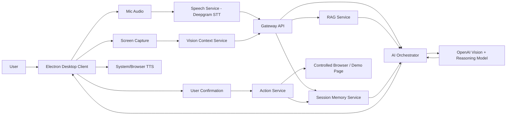

# NeuraLens - Design Document

## 1. Project Summary

**NeuraLens** is a desktop AI assistant that can see the user's screen, listen to their voice, understand their current task, and guide them through the next best action.

The product is built for users who get stuck while coding, debugging, filling forms, navigating websites, learning online, or completing multi-step digital workflows. Instead of switching between browser tabs, search results, docs, and AI chat windows, users can talk naturally to NeuraLens while it reads the current screen context.

### One-Line Pitch

NeuraLens is a voice-first screen intelligence agent that sees your workspace, understands your intent, and guides your next action.

### Hackathon Positioning

NeuraLens fits multiple hackathon tracks:

- **AI Agents:** multi-step reasoning, tool use, safe actions, contextual automation.
- **Developer Tools:** screen-aware coding help, debugging, docs lookup, LeetCode guidance.
- **Productivity:** browser/task guidance, form filling, workflow assistance.
- **Education:** interactive tutor for coding and web workflows.

The project should be presented as a working product, not just an AI wrapper. The winning angle is:

> "A multimodal desktop copilot that combines voice, screen understanding, retrieval, and controlled actions into one seamless assistant."

---

## 2. Problem Statement

Users often get stuck while working on a computer because they need help that understands the exact visible context:

- A coding error in VS Code or browser console.
- A failing LeetCode submission.
- A confusing documentation page.
- A multi-step web flow like booking, applying, comparing, or filling forms.
- A tutorial/video where the user does not know what to do next.

Current AI chatbots require users to copy-paste text, describe screenshots manually, or switch tabs repeatedly. This breaks flow and makes AI help feel disconnected from the actual workspace.

NeuraLens solves this by letting users speak naturally while the assistant sees the screen and responds with contextual guidance.

---

## 3. Target Users

### Primary Users

1. **Developers and students**
   - Debugging code.
   - Solving LeetCode.
   - Understanding errors.
   - Navigating documentation.

2. **Power users**
   - Completing browser workflows.
   - Searching, comparing, and summarizing.
   - Filling structured forms.

3. **Learners**
   - Following tutorials.
   - Understanding UI instructions.
   - Getting step-by-step help.

### Hackathon Demo User

A developer is stuck on a React/JavaScript error. They open NeuraLens, share their screen, ask by voice what is wrong, and NeuraLens explains the issue, suggests the fix, opens relevant documentation, and guides the user step-by-step.

---

## 4. Product Goals

### Core Goals

- Let users share their desktop/app/browser screen.
- Let users speak to the assistant.
- Capture the current screen frame and extract visible context.
- Use an OpenAI vision-capable model to reason over the screen and user request.
- Retrieve relevant knowledge from a local RAG knowledge base.
- Respond with clear next steps.
- Optionally perform safe, approved actions in a controlled browser session.

### Non-Goals For Hackathon MVP

- Full autonomous desktop control across all Windows apps.
- Entering passwords, OTPs, payment details, or private credentials.
- Bypassing CAPTCHA or website restrictions.
- Real money transactions.
- Fully replacing a human operator.

These constraints should be clearly mentioned in the demo as safety decisions.

---

## 5. Key Differentiators

1. **Screen-native context**
   - The assistant understands what is visible, not just what the user typed.

2. **Voice-first interaction**
   - Users can keep working while asking questions naturally.

3. **Task-aware memory**
   - NeuraLens remembers the user's current goal, previous steps, and unresolved blockers.

4. **Guidance plus action**
   - The assistant can either guide the user or perform limited safe browser actions after confirmation.

5. **RAG-powered domain intelligence**
   - The assistant has curated knowledge for coding, debugging, web workflows, and safety rules.

6. **Hackathon-ready demo clarity**
   - The product can show a complete end-to-end experience in under 3 minutes.

---

## 6. MVP Feature Set

### Must-Have Features

1. **Desktop app shell**
   - Built using Electron or Tauri.
   - Floating assistant window.
   - Microphone permission.
   - Screen capture permission.

2. **Screen share capture**
   - User selects screen/window.
   - App captures frames at controlled intervals.
   - Capture frequency can be reduced to save cost.

3. **Voice input**
   - Deepgram streaming speech-to-text, or browser speech recognition fallback.
   - Live transcript shown in UI.

4. **AI reasoning**
   - OpenAI model receives:
     - user transcript,
     - current screenshot,
     - previous short memory,
     - retrieved RAG snippets,
     - available action schema.

5. **RAG knowledge base**
   - Local markdown/JSON knowledge files.
   - Vector search or keyword-plus-embedding hybrid retrieval.
   - Focused domains:
     - React/JavaScript debugging.
     - LeetCode problem-solving strategies.
     - Browser workflow guidance.
     - Safe agent behavior.

6. **Response panel**
   - Shows AI explanation.
   - Shows next steps.
   - Shows confidence and assumptions.
   - Shows suggested actions.

7. **Text-to-speech**
   - Browser/system TTS for cost-effective voice output.
   - Optional Deepgram TTS if time allows.

8. **Safe action layer**
   - Actions are not executed silently.
   - User confirms before automation.
   - MVP actions:
     - open URL,
     - search query,
     - summarize current page,
     - fill mock form,
     - click approved selector in demo browser,
     - copy suggested code patch.

9. **Demo mode**
   - Preloaded broken React app scenario.
   - Preloaded mock booking/form workflow.
   - Stable paths for judges to test.

---

## 7. Stretch Features

These can help win if core MVP is stable:

1. **Realtime conversation mode**
   - Use OpenAI Realtime API if budget and time allow.
   - Keep regular STT -> LLM -> TTS as default mode.

2. **OCR fallback**
   - Use local OCR such as Tesseract or cloud OCR to extract visible text.
   - Helps reduce image tokens by sending text context.

3. **Code patch mode**
   - Detect visible error.
   - Generate patch suggestion.
   - Provide copy button.

4. **Browser automation sandbox**
   - Built-in browser window controlled by Playwright.
   - Safe demo websites only.

5. **Session timeline**
   - Shows what the user asked, what the assistant saw, what it suggested, and what actions were taken.

6. **Skill packs**
   - Developer mode.
   - Web task mode.
   - Learning mode.
   - Accessibility mode.

7. **Cost dashboard**
   - Shows estimated API usage and token spend.
   - Demonstrates product maturity.

---

## 8. Recommended Tech Stack

### Desktop App

**Recommended:** Electron + React + Vite

Why:

- Fast to build.
- Easy screen capture APIs.
- Easy integration with browser speech/TTS patterns.
- Familiar web stack for hackathon speed.
- Works well with Node services and local files.

Alternative:

- Tauri + React for lighter app size, but it may take longer if the team is less familiar.

### Frontend

- React
- Vite
- TypeScript
- Tailwind CSS
- Zustand or Redux Toolkit for local state
- shadcn/ui or custom compact UI components
- Lucide icons

### Backend / Local Services

- Node.js
- Express or Fastify
- WebSocket server for live transcription/events
- Worker process for screenshot processing and AI requests
- SQLite for local session history
- ChromaDB, LanceDB, or local JSON vector index for RAG

### AI Providers

**Core reasoning:**

- OpenAI Responses API with a vision-capable model.
- Use a configurable model name through environment variables.
- Recommended app setting:
  - `OPENAI_MODEL=latest-mini-vision-model`
  - Keep model swappable for cost/performance.

**Speech-to-text:**

- Deepgram streaming STT.
- Browser speech recognition fallback.

**Text-to-speech:**

- Browser/system TTS for MVP.
- Deepgram Aura or OpenAI TTS as optional polish.

**Embeddings:**

- OpenAI embeddings if API budget allows.
- Local embedding model or keyword retrieval if avoiding extra cost.

### Automation

- Playwright for controlled browser automation.
- Do not automate arbitrary external sites in the demo.
- Use a local/mock task page for reliable action demos.

### Storage

- SQLite:
  - sessions,
  - transcript chunks,
  - AI messages,
  - action logs,
  - saved tasks.

- Local file storage:
  - temporary screenshots,
  - RAG documents,
  - app settings.

### Deployment

Hackathon deliverables can include:

- Public repo.
- Hosted web landing/demo page.
- Desktop build artifact or downloadable installer.
- Demo video.
- README with setup instructions and API key requirements.

For the prototype, a desktop app plus a web landing page is enough.

---

## 9. Microservice Architecture

For hackathon speed, run services locally but design them as clear microservices. Each service can start as a module in one monorepo and later be split out.

### Services

#### 1. Desktop Client

Responsibilities:

- Screen capture.
- Microphone capture.
- Voice UI.
- Assistant panel.
- User confirmation dialogs.
- Display responses and action cards.

Technology:

- Electron + React + TypeScript.

#### 2. Gateway API

Responsibilities:

- Central API entry point.
- Auth/config validation.
- Request routing.
- WebSocket connection management.

Technology:

- Node.js + Fastify/Express.

Endpoints:

- `POST /api/session/start`
- `POST /api/session/end`
- `POST /api/assistant/ask`
- `POST /api/screen/analyze`
- `POST /api/actions/confirm`
- `GET /api/session/:id/timeline`

#### 3. Speech Service

Responsibilities:

- Stream mic audio to Deepgram.
- Receive partial and final transcripts.
- Send transcript events to client.

Technology:

- Node.js WebSocket bridge.
- Deepgram SDK/API.

Events:

- `speech.partial`
- `speech.final`
- `speech.error`

#### 4. Vision Context Service

Responsibilities:

- Receive screenshot frames.
- Compress/resize frames.
- Decide when to send image to AI.
- Optionally run OCR.
- Cache last known visual context.

Technology:

- Node.js worker.
- Sharp for image resizing.
- Optional OCR worker.

Design rule:

- Do not send every frame to the model.
- Send screenshot only when:
  - user asks a question,
  - screen changes significantly,
  - action requires visual confirmation,
  - user manually requests analysis.

#### 5. RAG Service

Responsibilities:

- Store curated knowledge.
- Retrieve relevant snippets for user query and screen context.
- Return compact context to AI Orchestrator.

Technology:

- Local vector store or SQLite FTS.
- OpenAI embeddings or local embeddings.

Knowledge collections:

- `developer_debugging`
- `leetcode_patterns`
- `browser_workflows`
- `agent_safety`
- `product_docs`

#### 6. AI Orchestrator Service

Responsibilities:

- Build the final prompt.
- Combine:
  - user transcript,
  - screenshot,
  - retrieved RAG,
  - conversation memory,
  - available actions,
  - safety policy.
- Call OpenAI.
- Parse structured response.

Technology:

- Node.js service.
- OpenAI SDK.
- Zod for structured response validation.

Output schema:

```json
{
  "mode": "guide | action_suggestion | clarify | safety_block",
  "summary": "What the assistant understood",
  "answer": "User-facing response",
  "next_steps": ["Step 1", "Step 2", "Step 3"],
  "suggested_actions": [
    {
      "type": "open_url | web_search | fill_form | click | copy_patch",
      "label": "Open React docs",
      "requires_confirmation": true,
      "payload": {}
    }
  ],
  "safety_notes": ["No passwords or payment actions"],
  "confidence": 0.82
}
```

#### 7. Action Service

Responsibilities:

- Execute approved safe actions.
- Log every action.
- Reject unsafe actions.

Technology:

- Playwright.
- Local browser context.

Allowed MVP actions:

- Open URL.
- Search web.
- Navigate demo page.
- Fill demo form.
- Click allowlisted selectors.
- Copy text to clipboard.

Blocked actions:

- Password entry.
- Payment submission.
- OTP entry.
- CAPTCHA handling.
- Deleting files or data.
- Sending messages without confirmation.

#### 8. Session Memory Service

Responsibilities:

- Store short-term task context.
- Summarize conversation.
- Track current goal.
- Save action timeline.

Technology:

- SQLite.
- In-memory cache for active session.

---

## 10. Architecture Diagram



---

## 11. Data Flow

### Voice Question Flow

1. User clicks "Start Session."
2. User selects screen/window.
3. User speaks.
4. Speech Service converts speech to text.
5. Desktop sends latest screenshot and final transcript to Gateway.
6. Vision Context Service optimizes screenshot.
7. RAG Service retrieves relevant snippets.
8. AI Orchestrator calls OpenAI with multimodal context.
9. Structured AI response returns.
10. Desktop displays response and speaks it aloud.
11. Suggested action cards are shown.
12. User confirms or rejects actions.

### Safe Action Flow

1. AI suggests an action.
2. UI shows action card with exact operation.
3. User clicks "Approve."
4. Action Service validates action against policy.
5. Action executes in controlled browser/demo page.
6. Result is logged.
7. Assistant summarizes what happened.

---

## 12. RAG Design

### Why RAG Is Needed

RAG makes NeuraLens more than a generic vision chatbot. It gives the assistant task-specific behavior and reliable workflow knowledge.

### RAG Knowledge Sources

#### Developer Debugging Pack

Examples:

- Common React errors.
- JavaScript runtime errors.
- npm install/build issues.
- Git troubleshooting.
- Browser console debugging.
- API request debugging.

Sample documents:

- `react_common_errors.md`
- `js_runtime_errors.md`
- `npm_debugging.md`
- `browser_console_debugging.md`
- `git_workflows.md`

#### LeetCode Pack

Examples:

- Sliding window.
- Two pointers.
- Binary search.
- Dynamic programming.
- Graph traversal.
- Stack/monotonic stack.

Sample documents:

- `leetcode_patterns.md`
- `debugging_wrong_answer.md`
- `complexity_explainer.md`

#### Browser Workflow Pack

Examples:

- Form filling strategy.
- Comparing options.
- Booking workflow checklist.
- Search refinement.
- Reading tables.
- Summarizing terms and conditions.

Sample documents:

- `form_filling.md`
- `booking_workflows.md`
- `comparison_tasks.md`

#### Safety Pack

Examples:

- Never enter passwords.
- Never submit payment.
- Ask confirmation before clicks.
- Explain uncertainty.
- Prefer guidance when screen context is unclear.

Sample documents:

- `action_safety_policy.md`
- `privacy_rules.md`
- `confirmation_rules.md`

### Retrieval Strategy

MVP retrieval can be hybrid:

1. Extract keywords from user transcript.
2. Include visible text from OCR if available.
3. Search local docs using embeddings or SQLite FTS.
4. Return top 3-5 snippets.
5. Compress snippets before sending to OpenAI.

### RAG Prompt Contract

The model should treat RAG as support, not as absolute truth:

- Use RAG when relevant.
- If screen evidence conflicts with RAG, explain uncertainty.
- Do not invent invisible screen details.
- Ask a clarifying question if required.

---

## 13. AI Prompting Strategy

### System Instruction Themes

NeuraLens should be instructed to:

- Be concise and action-oriented.
- Mention what it sees on screen.
- Identify the user's likely goal.
- Give the next best step.
- Provide no more than 3-5 steps at a time.
- Ask before acting.
- Refuse unsafe automation.
- Avoid pretending to see details that are not visible.

### Assistant Response Style

Good response:

> "I can see a React error mentioning an undefined property. The likely issue is that the component expects `user.name`, but `user` is null during initial render. First add a loading guard, then verify the API response shape."

Bad response:

> "Here is a long general explanation of React rendering..."

### Structured Model Output

Require JSON output from the model to keep UI predictable.

Fields:

- `screen_observation`
- `user_intent`
- `answer`
- `next_steps`
- `suggested_actions`
- `requires_confirmation`
- `risk_level`
- `confidence`

---

## 14. UI / UX Design

### Design Principles

- Desktop-native, compact, and useful.
- No marketing-style landing screen inside the app.
- The first screen should be the actual assistant workspace.
- Clear current state: listening, thinking, seeing, acting.
- User always knows what the assistant can see and do.
- Actions are visible and confirmable.

### Visual Direction

Brand feel:

- Technical.
- Calm.
- Intelligent.
- High trust.

Suggested palette:

- Background: near-black or deep graphite.
- Primary: electric cyan or signal green.
- Accent: soft violet or blue for AI state.
- Warning: amber.
- Danger: red.
- Text: high contrast white/gray.

Avoid:

- Overly playful UI.
- Huge hero sections.
- Decorative clutter.
- One-color monotone palette.

### Main App Layout

```txt
+--------------------------------------------------------------+
| NeuraLens                                      Session Active |
+----------------------+---------------------------------------+
| Screen Context       | Assistant                             |
|                      |                                       |
| [Live screen tile]   | User: Why is this error happening?    |
|                      |                                       |
| Visible app: Chrome  | AI: I can see a React runtime error...|
| Context: Coding      |                                       |
| Confidence: 82%      | Next steps:                           |
|                      | 1. Check the API response             |
| [Analyze Screen]     | 2. Add a null guard                   |
| [Pause Capture]      | 3. Re-run the app                     |
|                      |                                       |
|                      | Suggested action:                     |
|                      | [Open React docs] [Copy patch]        |
+----------------------+---------------------------------------+
| Mic: Listening...  Transcript: "What should I do next?"       |
+--------------------------------------------------------------+
```

### Key UI Components

#### 1. Session Header

Shows:

- App name: NeuraLens.
- Session state:
  - idle,
  - listening,
  - thinking,
  - guiding,
  - awaiting confirmation,
  - acting.
- API/model indicator.
- Cost mode:
  - economy,
  - balanced,
  - realtime.

#### 2. Screen Context Panel

Shows:

- Current screen preview.
- Last analyzed timestamp.
- Detected app/window name if available.
- Current task mode:
  - coding,
  - web task,
  - learning,
  - general.
- Capture controls:
  - start sharing,
  - pause,
  - analyze now.

#### 3. Voice Control Bar

Shows:

- Microphone state.
- Live transcript.
- Push-to-talk option.
- Mute button.
- Stop response button.

#### 4. Assistant Conversation Panel

Shows:

- User transcript.
- AI response.
- Screen observation.
- Next steps.
- Confidence.
- Clarifying questions.

#### 5. Action Cards

Each action card includes:

- Action name.
- What will happen.
- Why it is suggested.
- Risk level.
- Approve button.
- Reject button.

Example:

```txt
Suggested Action
Open React documentation for conditional rendering

Why: The visible error suggests a null render issue.
Risk: Low

[Approve] [Reject]
```

#### 6. Timeline Drawer

Shows:

- User asked.
- Screen analyzed.
- RAG snippets used.
- AI suggested.
- User approved.
- Action executed.

This is useful for demo credibility.

---

## 15. Desktop App Screens

### Screen 1: Main Assistant Workspace

Purpose:

- Default first screen.
- Start session.
- See assistant state.
- Ask voice questions.

Primary controls:

- Start screen share.
- Start listening.
- Analyze screen.
- Ask manually.

### Screen 2: Action Approval Modal

Purpose:

- Prevent unsafe automation.

Content:

- Exact action.
- Target app/browser.
- Data that will be used.
- Risk level.
- Approve/Cancel.

### Screen 3: Settings

Sections:

- OpenAI API key.
- Deepgram API key.
- Model selection.
- Capture interval.
- Voice provider.
- TTS provider.
- Privacy settings.

### Screen 4: Knowledge Packs

Purpose:

- Show RAG is intentional.

Features:

- Developer Debugging: enabled.
- LeetCode Patterns: enabled.
- Browser Workflows: enabled.
- Safety Rules: locked/enabled.

### Screen 5: Demo Browser / Task Sandbox

Purpose:

- Controlled browser actions.

Includes:

- Broken React demo page.
- Mock travel booking form.
- Mock job application form.
- Docs/search demo.

---

## 16. Feature List For Winning

### High-Impact MVP Features

1. Screen-aware voice Q&A.
2. Screenshot-based reasoning.
3. Developer debugging mode.
4. RAG-backed next steps.
5. Safe action suggestions.
6. Confirm-before-action automation.
7. TTS response.
8. Session timeline.
9. Polished desktop UI.
10. Stable demo sandbox.

### "Wow" Features

1. AI identifies exact visible coding error.
2. AI suggests a code patch.
3. User says "open the docs" and the app opens relevant documentation.
4. AI fills a mock web form after confirmation.
5. AI remembers the user's goal across multiple questions.
6. AI explains what it sees before giving advice.
7. AI refuses unsafe actions gracefully.

### Judge-Friendly Features

1. Public repo with clean README.
2. 3-minute demo video.
3. Simple hosted landing page.
4. Desktop app installer or clear local run command.
5. Example API key setup.
6. Architecture diagram.
7. Safety section.
8. Future roadmap.

---

## 17. Demo Plan

### Demo Duration

Maximum 3 minutes.

### Demo Story

**Scene 1: Coding Help**

1. Open a broken React app or LeetCode page.
2. Start NeuraLens.
3. Share screen.
4. Ask by voice: "Why is this broken?"
5. NeuraLens says what it sees.
6. NeuraLens explains the likely issue.
7. NeuraLens gives 3 steps.
8. NeuraLens suggests opening docs or copying a patch.

**Scene 2: Browser Workflow**

1. Open mock booking/form page.
2. Ask: "Help me fill this for Delhi to Mumbai tomorrow."
3. NeuraLens reads the page.
4. It suggests filling fields.
5. User approves.
6. NeuraLens fills the mock form.
7. It stops before final submit/payment.

**Scene 3: Safety and Trust**

1. Ask it to enter a password/payment detail.
2. It refuses and explains safety boundary.

### Final Demo Message

> "NeuraLens turns AI from a separate chat box into an intelligent communication layer over your workspace."

---

## 18. Security and Privacy

### Privacy Principles

- User controls screen sharing.
- User can pause capture at any time.
- Screenshots are not stored permanently by default.
- Sensitive actions require confirmation.
- Passwords, OTPs, and payment data are blocked.

### Data Handling

- Store only session summaries by default.
- Temporary screenshots deleted after analysis.
- Action logs store metadata, not private content.
- API keys stored locally in encrypted storage if possible.

### Safety Rules

The assistant must not:

- Enter passwords.
- Submit payments.
- Bypass CAPTCHA.
- Send messages/emails without confirmation.
- Delete or modify user files.
- Pretend to know invisible information.

---

## 19. Implementation Plan

### Day 1: Core Shell and Screen Capture

- Set up Electron + React + TypeScript.
- Build main assistant UI.
- Implement screen capture.
- Implement screenshot preview.
- Add manual text input.
- Connect OpenAI vision request.

Deliverable:

- User can ask a text question about screenshot.

### Day 2: Voice and RAG

- Add Deepgram STT.
- Add TTS.
- Create RAG knowledge files.
- Implement retrieval.
- Add structured AI responses.
- Build next-step UI.

Deliverable:

- User can speak and receive screen-aware voice guidance.

### Day 3: Actions and Demo Sandbox

- Add Playwright action service.
- Build safe action schema.
- Add confirmation UI.
- Create mock booking/form page.
- Create broken React/code demo.

Deliverable:

- User can approve actions and see automation work.

### Day 4: Polish and Submission

- Improve UI.
- Add timeline drawer.
- Add settings.
- Write README.
- Record demo video.
- Deploy landing page.
- Prepare slides.

Deliverable:

- Submission-ready prototype.

---

## 20. Suggested Repository Structure

```txt
neuralens/
  apps/
    desktop/
      src/
        components/
        screens/
        services/
        state/
        styles/
      electron/
      package.json
  services/
    gateway/
      src/
        routes/
        websocket/
        config/
    speech/
      src/
    vision/
      src/
    rag/
      src/
    orchestrator/
      src/
    actions/
      src/
  knowledge/
    developer_debugging/
    leetcode_patterns/
    browser_workflows/
    safety/
  demo/
    broken-react-app/
    mock-booking-page/
  docs/
    architecture.md
    safety.md
    demo-script.md
  README.md
```

---

## 21. Environment Variables

```txt
OPENAI_API_KEY=
OPENAI_MODEL=
OPENAI_EMBEDDING_MODEL=
DEEPGRAM_API_KEY=
STT_PROVIDER=deepgram
TTS_PROVIDER=system
CAPTURE_INTERVAL_MS=1500
ENABLE_ACTIONS=true
ENABLE_SCREEN_STORAGE=false
```

---

## 22. API Design

### Ask Assistant

`POST /api/assistant/ask`

Request:

```json
{
  "sessionId": "session_123",
  "userText": "Why is this React error happening?",
  "screenshotBase64": "data:image/jpeg;base64,...",
  "mode": "coding",
  "allowActions": true
}
```

Response:

```json
{
  "screenObservation": "The screen shows a React runtime error...",
  "userIntent": "The user wants debugging help.",
  "answer": "This likely happens because...",
  "nextSteps": ["Add a null guard", "Check API response", "Re-run app"],
  "suggestedActions": [
    {
      "id": "action_1",
      "type": "open_url",
      "label": "Open React conditional rendering docs",
      "requiresConfirmation": true,
      "risk": "low"
    }
  ],
  "confidence": 0.84
}
```

### Confirm Action

`POST /api/actions/confirm`

Request:

```json
{
  "sessionId": "session_123",
  "actionId": "action_1",
  "approved": true
}
```

Response:

```json
{
  "status": "completed",
  "message": "Opened React documentation."
}
```

---

## 23. Evaluation Against Hackathon Criteria

### Originality

NeuraLens is not another chatbot. It is a screen-aware, voice-first, action-capable desktop assistant.

### Impact

It helps developers, students, and everyday users complete real computer tasks faster.

### AI Fluency

AI is central:

- multimodal screen understanding,
- voice interaction,
- RAG,
- structured reasoning,
- agentic actions.

### Prototype

Judges can click and test:

- share screen,
- ask by voice,
- receive guidance,
- approve an action,
- see task automation.

### Demo

The demo is clear:

- problem,
- product,
- payoff,
- safety.

### Creativity

The product reframes AI as a communication layer between the user and their workspace.

---

## 24. Risks and Mitigations

### Risk: Voice latency

Mitigation:

- Use Deepgram streaming STT.
- Use browser/system TTS.
- Keep model responses short.

### Risk: OpenAI vision cost

Mitigation:

- Resize screenshots.
- Send screenshots only on demand.
- Cache screen context.
- Use smaller vision model where possible.

### Risk: Automation breaks on real websites

Mitigation:

- Use controlled demo pages.
- For real websites, provide guidance rather than action.

### Risk: Too broad scope

Mitigation:

- Build coding help and mock web workflow first.
- Keep arbitrary desktop automation as future roadmap.

### Risk: Privacy concerns

Mitigation:

- Clear screen capture state.
- Pause button.
- No permanent screenshot storage by default.
- Safety policy visible in settings.

---

## 25. Roadmap

### Hackathon MVP

- Desktop app.
- Screen share.
- Voice input.
- OpenAI screen reasoning.
- RAG.
- TTS.
- Safe action cards.
- Demo browser automation.

### Post-Hackathon V1

- Native Windows accessibility APIs.
- Better OCR.
- App-specific skills.
- More robust browser automation.
- Personal memory.
- Team workspace mode.

### Future Vision

NeuraLens becomes a universal communication layer for human-computer interaction:

- sees your workspace,
- understands your intent,
- guides your next move,
- safely acts when you approve.

---

## 26. Final Build Recommendation

Build the most reliable version first:

```txt
Electron Desktop App
+ Deepgram STT
+ OpenAI vision/reasoning
+ local RAG
+ system TTS
+ Playwright safe actions
+ polished demo sandbox
```

Do not make full OpenAI Realtime mode the core dependency. Add it only if there is enough time and API budget.

The project can win if the demo feels seamless:

1. User speaks naturally.
2. NeuraLens sees the screen.
3. It explains the exact issue.
4. It suggests the next action.
5. It performs a safe approved action.

That is the core magic.
